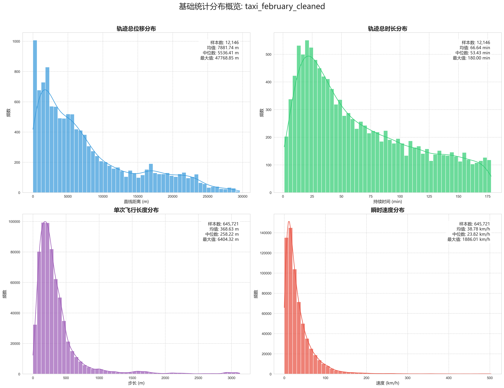
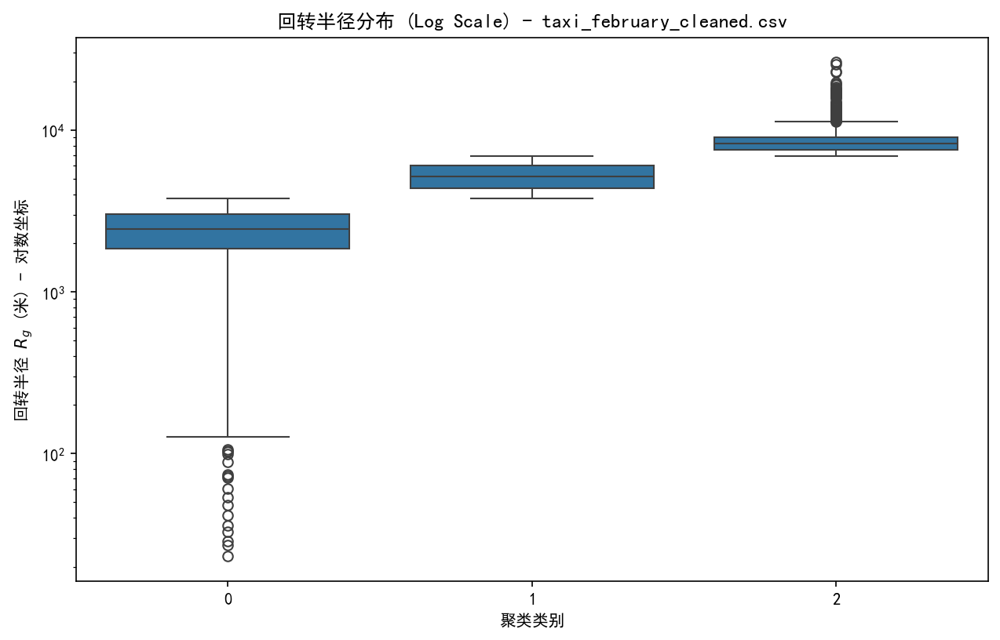
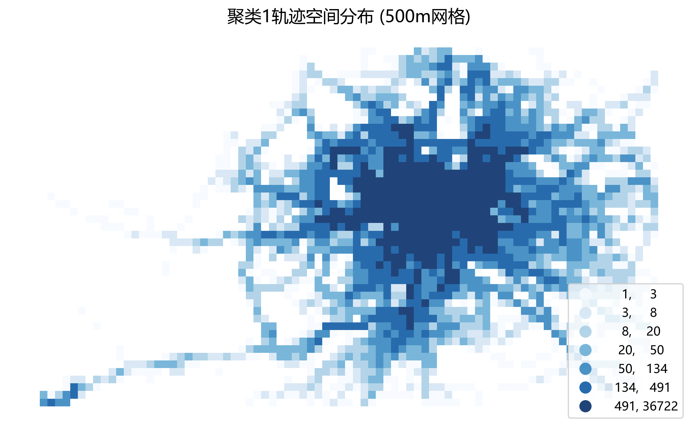
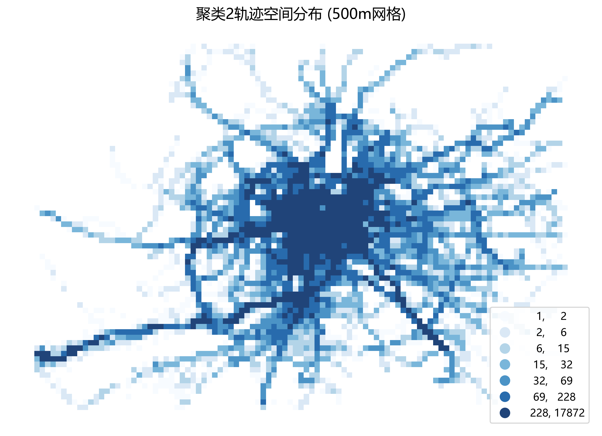

# Quantum Walk Traffic Simulation
[](https://www.python.org/)
[](LICENSE)

This project is an automated data processing and analysis workflow for the application of quantum walk algorithms in urban traffic flow simulation. Through a modular design, the complex quantum state evolution, topological network mapping, and result analysis are decomposed into independent and traceable task steps.

## 📂 Directory Structure Explanation

```text
├── data/               # Original data (such as road network topology, initial flow distribution, etc.)
├── results/            # Store the processed results and charts (such as probability distribution graphs, convergence curves)
├── src/                # Core processing script
├── README.md           # Project User Manual
└── requirements.txt    # List of Dependent Libraries
```

---

## 🛠 functional characteristics

* ​**building block design**​：Each processing step is logically independent and supports starting the operation from any intermediate step.
* ​**Automated workflow**​：Automatically read the data from "data/" and generate intermediate variables in a stepwise manner, then store them in "results/".
* ​**Research-grade drawing**​：Built-in visualization scripts based on Matplotlib/Seaborn, which directly generate charts that meet the standards of academic papers.
---

## 🚀 Data processing procedure

Please run the scripts in the src/ directory in sequence to complete the entire analysis process:

### Step 1: src/Trajectory_preprocessing_and_simplification.py

* ​**function**​：​**Standardization and Compression Cleaning of Multi-source Trajectory Data**​。
  
  * ​**Intelligent Parsing**​：Automatically recognize Roman data (in TXT/POINT format) and the mainstream CSV tracking format in China, with the unified fields being [id, time, lon, lat].
  * ​**Cleaning and noise reduction**​：Using the transbigdata toolkit, we removed the points with drifting latitude and longitude, abnormal speed values, and redundant duplicate records.
  * ​**Trajectory simplification**​：Integrating the **Douglas-Peucker (DP) algorithm**, it significantly reduces the data dimension while preserving the geometric features of the trajectory.
  * ​**Standardized output**​：Automatically filter out invalid trajectories that are shorter than 5 points, and consecutively renumber the IDs to prepare high-quality input for the subsequent quantum walk simulation.
* ​**import**​：The original TXT or CSV files located in the "data/Original Data/" directory.
* ​**output**​：The normalized \*\_cleaned.csv file located in the "data" directory after the original data has been processed.

### Step 2: src/Overall_data_statistics.py

* ​**function**​：​**Advanced noise reduction, trajectory segmentation and temporal-spatial feature extraction**​。
  
  * ​**Automatic range locking **​：Based on the quantile algorithm, the geographical scope of the city is automatically identified and locked, and outliers such as those across cities or with abnormal coordinates (such as 0,0) are precisely eliminated.
  * ​**Dynamical denoising**​：Set a physical speed limit (150 km/h), and filter out non-logical trajectories such as teleportation and waypoints by using vectorized displacement calculations.
  * ​**Logical segmentation and smoothing**​：The trajectories of the data with long-term persistence are segmented, and the sliding window algorithm (Rolling Mean) is applied to smooth out the positioning errors and eliminate signal jitter.
  * ​**Duration and point count filtering**​：Automatically eliminate trajectories that are exceptionally long (exceeding 3 hours) or have too sparse recording points, to ensure the continuity of the modeling data.
* ​**import**​：data/AfterProcessing/ The cleaned CSV file under the directory。
* ​**output**​：data/Overall_data_statistics/ High-quality research-grade trajectory data under the directory。

### Step 3: src/Overall_statistics_charting.py

* ​**function**​：​**Multidimensional Time-Space Statistical Analysis and Visualization of Diffusion Phase Transition**​。
  
  * **Basic Distribution Statistics **：Automatically extract and draw probability distribution graphs of the total displacement, total duration, single flight length (Flight Length), and instantaneous speed of the trajectory. Use the quantile algorithm to eliminate outliers, and visually present the basic characteristics of urban traffic flow.
  * ​**MSD omnidirectional displacement analysis**​：Calculate the mean squared displacement (Mean Squared Displacement) at different time steps (Δt), and reveal the spatial diffusion rate of the individual.
  * **Extraction of diffusion phase transition index**：Using the Savitzky-Golay filter to smooth the logarithmic curve and calculate the gradient, dynamically identify whether the trajectory is in the "sub-diffusion", "normal diffusion" or "super-diffusion" state.
  * ​**Strict truncation mechanism**​：It incorporates the "bottom rebound" and "zero-point truncation" logic, automatically identifying and discarding data intervals with invalid physical meanings, ensuring the scientific rigor of the diffusion feature analysis.
* ​**import**​：data/Overall_data_statistics/ The cleaned CSV files under the directory.
* ​**output**​：in data/Overall_data_statistics/ The following creates a folder with the same name for each file, which contains:
  
  * \*\_Basic_distribution_statistics.png：Macro-statistics Four-in-One Chart.
  * \*\_Analysis_of_diffusion_phase_transformation.png：MSD and α index evolution diagram.
  * \*\_msd\_result\_full.csv & \*\_vis.csv：The complete original data for diffusion analysis and the truncated data.

#### 📊 results display (Take the data from Rome as an example)

| Basic Distribution Chart                                      | Diffusion phase transformation analysis diagram                                       |
| ----------------------------------------------------------------- | ----------------------------------------------------------------- |
|  | |

### Step 4: src/Rg_Calculation_and_Classification.py

* ​**function**​：**Individual mobility measurement and multi-scale classification (analysis of turning radius Rg)**。
  
  * ​**Calculation of turning radius**​：Using the geodesic distance algorithm, the rotation radius Rg​ of each trajectory relative to its centroid is calculated, which serves as the core indicator for measuring the individual's spatial activity range.
  * ​**Adaptive clustering analysis**​：Integrate **K-means clustering** with **the Elbow Method**.Automatically determine the optimal number of classifications, and divide the massive trajectories into different energy levels based on their spatial expansion capabilities (such as: small scale, medium scale, and large scale).
  * ​**Logical reordering**​：By performing mean mapping on the clustering labels, it is ensured that the classification results have physical significance (for example: Label 1 always corresponds to the short-distance activity group with the smallest Rg value).
  * ​**Multi-level data splitting**​：Automatically generate sub-data sets after classification, providing sample support for subsequent studies on the quantum walk characteristics of different mobility groups.

#### 📊 results display (Take the data from Rome as an example)

| Elbow rule analysis (determining the K value)                                        | Radius of curvature distribution (classification result)                                         |
| ----------------------------------------------------------------- | ----------------------------------------------------------------- |
| |  |

* ​**import**​：data/AfterProcessing/ The cleaned trajectory CSV file under the directory.
* ​**output**​：在 data/Classified_data/ Generated under the directory:
  
  * Cluster [1,2,3] Trajectory Data.csv: Independent datasets after splitting by movement scale.
  * Summary_Turning_Radius.csv & Cluster_label_results.csv：Detailed statistical and classification label correspondence table.

### Step 5: src/Trajectory_processing.py

* ​**function**​：​**Second-order physical fine-tuning and dynamic segmentation of multi-scale subsets**​。
  
  * ​**Detailed classification and cleaning**​：For the "small/middle/large" scale datasets classified in Step 4, conduct targeted physical logic verification.
  * ​**Dynamic time segmentation**​：Set the threshold at 30 minutes. Automatically identify and segment the long-stationary points in the trajectory, and split a single long trajectory into "sub-trajectory segments" with continuous movement characteristics, in order to meet the assumption of the stable process of quantum walking.
  * ​**Dynamics smoothing**​：Apply the sliding window smoothing algorithm to correct GPS positioning jitter and improve the geometric quality of the trajectory.
  * ​**Recursive structure preservation**​：Automatic traversal data/Classified_data/ Navigate through all the city subfolders and maintain the original classification directory structure, achieving fully automatic batch processing.
* ​**key parameter**​：
  
  * MAX\_SPEED\_KMH = 150：Eliminate the instantaneous movement points that are beyond the realm of physical common sense.
  * MAX\_TIME\_GAP\_MIN = 30：If there is no displacement for more than 30 minutes, a new trajectory will be created.
  * MIN\_POINTS = 5：Ensure that each sample for analysis has sufficient statistical significance.
* ​**import**​：data/Classified_data/ Various scale trajectory CSV files under the directory.
* ​**output**​：在 data/Cleaning_data_after_segmentation/ Generate a refined dataset with the same name in the directory, and the file name will be automatically changed to \*\_Trajectory_processing_data.csv。

### Step 6: src/MSD_Local_Diffusion_Index.py

* ​**function**​：**Modeling of collective diffusion characteristics and analysis of local α-index**。
  
  * ​**Group MSD evolution**​：Within the subsets classified as small/middle/large scales, the ensemble mean displacement (Ensemble MSD) was calculated to reveal the spatial expansion patterns of different groups over time.
  * ​**Local diffusion index extraction**​：The logarithmic MSD curve was smoothed using the Savitzky-Golay filter, and the time dimension derivative α(t) was extracted to dynamically identify the physical properties of the traffic flow at different time stages (such as the transition from super-diffusion to sub-diffusion).
  * ​**Power-law Fit**：Perform linear regression in the double-logarithmic coordinate system, and automatically calculate the global proportion coefficient and the R2 goodness-of-fit.
  * ​**Statistical truncation protection**​：built-in REBOUND\_THRESHOLD Truncate the logic. When the data sample size becomes sparse due to the large time span, causing the α index to exhibit an abnormal rebound, automatic truncation will be carried out to ensure the scientific nature of the conclusion.

#### 📊 Display of diffusion characteristics results( α(t)Exponential evolution )


* ​**import**​：data/Cleaning_data_after_segmentation/ The refined trajectory data under the directory.
* ​**output**​：in data/Group_MSD_analysis_results/ The contents below are for generating a separate file for each cluster.
  
  * \*changes_in_MSD_of_the_clustering1_trajectory,_ results.csv：Structured data including time intervals, mean MSD values, and Alpha values.
  * \*changes_in_MSD_of_the_clustering1_trajectory,_ results.png：A twin plot containing the MSD fitting curve and the α evolution trajectory.

### Step 7: src/Density_zoning_calculation.py

* ​**function**​：​**Multi-scale Traffic Hotspot Identification and High-Density Spatial Grid Analysis**​。
  
  * ​**Fine-grained grid mapping**​：Using the transbigdata library, the geographical coordinates are mapped to high-precision geographic grids (with the default accuracy of 40m), achieving the conversion from continuous coordinates to discrete spatial units.
  * ​**Space density measurement**​：Count the frequency of trajectory points in each grid cell, and dynamically set the density threshold based on quantiles to automatically remove low-frequency background noise and identify the high-load areas of urban traffic.
  * ​**geographic information visualization**​：Integrate GeoPandas to draw a spatial distribution heat map, and present the occupancy characteristics of different scale groups (small/middle/large Rg) in the urban space through graded colors (Quantiles Scheme).
  * ​**Export of zoning results**​：Save the trajectory index of the high-density areas, providing spatial weight references for the parameter calibration of the subsequent quantum walk algorithm under different density distributions.

#### 📊 Spatial distribution results presentation (Take the data from Rome as an example)

| Clustering scale 1 (short distance) spatial distribution                                               | Clustering scale 2 (long-distance) spatial distribution                                              |
| -------------------------------------------------------------------------- | -------------------------------------------------------------------------- |
|  |  |

* ​**import**​：data/Classified_data/ The multi-scale trajectory dataset under the directory.
* ​**output**​：在 data/Density_analysis_results/ Generated under the directory:
  
  * \*Cluster_1_Trajectory_Spatial_Distribution.csv：It records the coordinates, the number of points, and the corresponding density level for each grid.
  * \*Cluster_1_Trajectory_Spatial_Distribution_Map.png：Grid-based traffic density distribution map based on geographic base map.

### Step 8: src/Build_road_graph.py

* **function**：**Vector reconstruction of road network and generation of topological graph structure based on trajectory density**。
  
  * **Vectorization extraction of road network**：Using ArcGIS, the grid trajectory density generated by Step 7 was log-standardized. The basic road skeleton was extracted through "File to Points" and vectorization tools, and then connected and simplified reasonably to generate a road vector file in the `.shp` format.
  * **Automatic coordinate system projection**：The system automatically identifies the **UTM projection zone** to which it belongs based on the road network's center of mass (such as EPSG:32633), and converts the geographic latitude and longitude coordinates into metric units to ensure the accuracy of the physical length calculation (length_m).
  * **Topological fusion and cleaning**：Use the `unary_union` operator to perform topological merging on the extracted scattered line segments, fix the disconnected roads and overlapping line segments, and automatically call `make_valid` to correct geometric topological errors, ensuring the connectivity of the road network.
  * **Graph theory relationship mapping and subdivision**：Based on the area of the research region, the edge length threshold (300m - 5000m) is automatically adjusted to perform interpolation segmentation for long sections; at the same time, all intersections are automatically extracted as **nodes (Nodes)** and a topology mapping table of **edges (Edges)** is established to build a complete mathematical graph model.

#### 🗺️ Road network extraction and graph structure reconstruction display

| Trajectory density and vector skeleton | Topology graph structure generation  |
| --------------------------------------------- | ------------------------------------------------------------------------------- |
|  |  |

* **import**：
  * `data/Density_analysis_results/` The CSV file of the trajectory space distribution in the directory.
  * Manually extract the generated `.shp` vector file of roads based on the trajectory density.
* **output**：在 `data/Density_analysis_results/[city]/road_network/` Generated under the directory:
  * `road_nodes.csv`：Record the global unique ID and projection coordinates of all intersection nodes.
  * `road_edges.csv`：An edge index table that includes the starting node, physical length, and geometric topology information.

### Step 9: src/Intelligent_roaming_quantum_fitting.py

* ​**function**​：​**Traffic flow evolution simulation based on continuous-time quantum walk (CTQW) and physical parameter regression**​。
  
  * ​**Spectral decomposition acceleration algorithm (Spectral Acceleration)​**​：By performing eigenvalue decomposition on the Laplacian/adjacency matrix of the road network, the computational complexity of quantum state evolution is reduced from O(N³) to O(N²). 。 By using feature space projection, high-frequency matrix exponential operations are avoided, significantly improving the simulation efficiency for large-scale road networks (with N > 1000).
  * ​**Intelligent Start Search (Smart Scout)​**​：By combining the degree centrality, geometric center, and grid sampling techniques, the system automatically identifies the initial node of the quantum walk that best represents the origin of urban transportation.
  * ​**Multistage Forward Regression (Multi-stage Fitting)​**​：
    * ​**The rough scanning stage**​：Search for the initial range of the coupling constant γ within a wide range.
    * ​**The precise fitting stage**​：By using double-layer gradient iteration, the physical parameters that precisely minimize the loss function between the simulated MSD and the real MSD are accurately determined.
  * ​**Physical consistency verification**​：Simultaneously fit the mean square displacement (MSD) and the diffusion index α(t)
    ，Ensure that the simulation process is not only aligned in terms of the rate of spatial expansion, but also physically consistent with the real traffic flow in terms of the diffusion phase transition behavior.
#### ⚛️ Quantum simulation is compared with real data to display α(t)

Alignment verification

|| (Note: The dotted lines represent the quantum simulation results, and the dots represent the observed data.) |
| - | - |

* ​**import**​：
* data/Group_MSD_analysis_results/：The dynamic statistical characteristics of real traffic flow.
* data/Construction_of_road_network_structure_topology/：Step 9 The generated standard road network structure.
* ​**output**​：在 data/forward_regression_result_quantum_walk/ Generated under the directory:
  
  * \*Cluster1_quantum_MSD_changes_and_diffusion_index_α_graph.csv：Comparison data table between quantum simulation and actual trajectory.
  * \*Cluster1_quantum_MSD_changes_and_diffusion_index_α_graph.png：A visual report including the γ fitting value, R2 score, and the coverage of the phase transition interval.

### infuse：Step 10（After the first step, you can directly run the following code for one-step processing. During this process, manual extraction of the road network is required.）

```
python src/main.py
```

## 📖 operating guide

### 1. Environmental Preparation

It is recommended to use a Python 3.9+ environment. First, clone the repository and install the dependencies:

### 2. Run the simulation

Enter the project root directory and execute the code in sequence:

---

## 📝 matters need attention

* ​**path dependence**​：Make sure to run the script in the root directory of the project, and use relative paths within the script.
* ​**memory usage**​：The quantum matrix evolution process may consume a considerable amount of memory. It is recommended to run it in an environment with at least 16GB of RAM.

## 🤝 Help and Support

* ​**Project maintenance**​：[你的名字]
* ​**contact via mail**​：[你的邮箱地址]


## Data Description

Due to the large size of the original trajectory data and the generated intermediate result files (each file exceeding 100MB) involved in this project, they cannot be directly uploaded to the GitHub repository. To ensure the code can run properly, please follow the steps below to obtain the data:

1. **Download data**：
   - link: [Download address of Baidu Netdisk](https://pan.baidu.com/s/1OBOrfi-s4tZMMxY10EX2NA?pwd=4hmd)
   - code: `4hmd`


