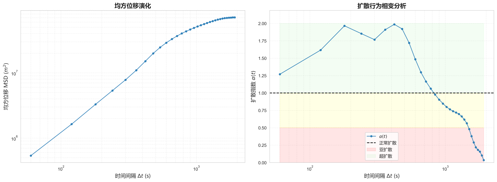
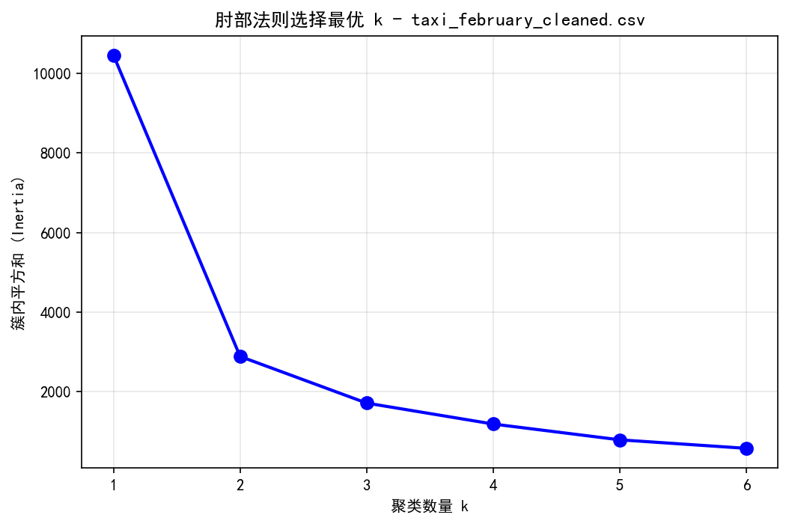
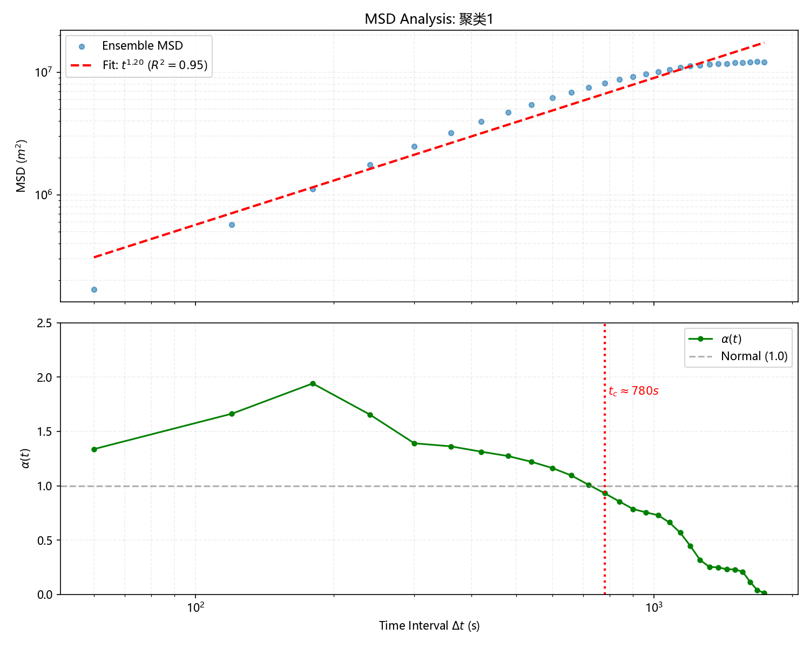
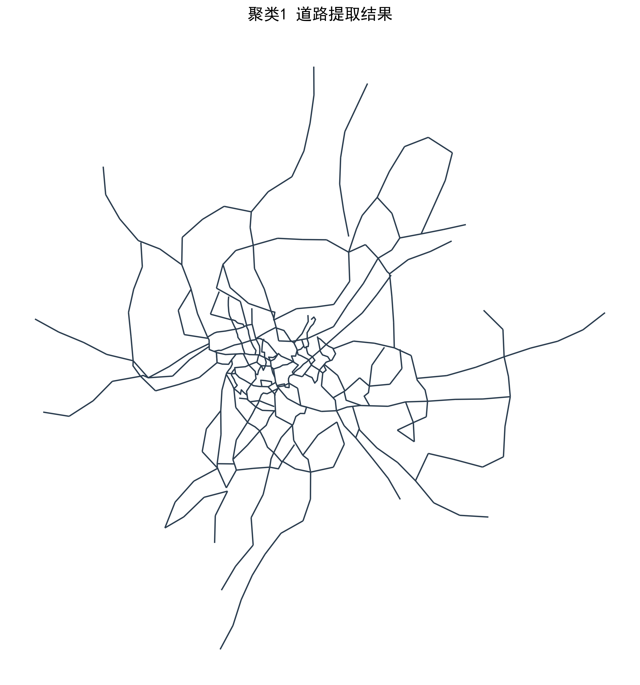
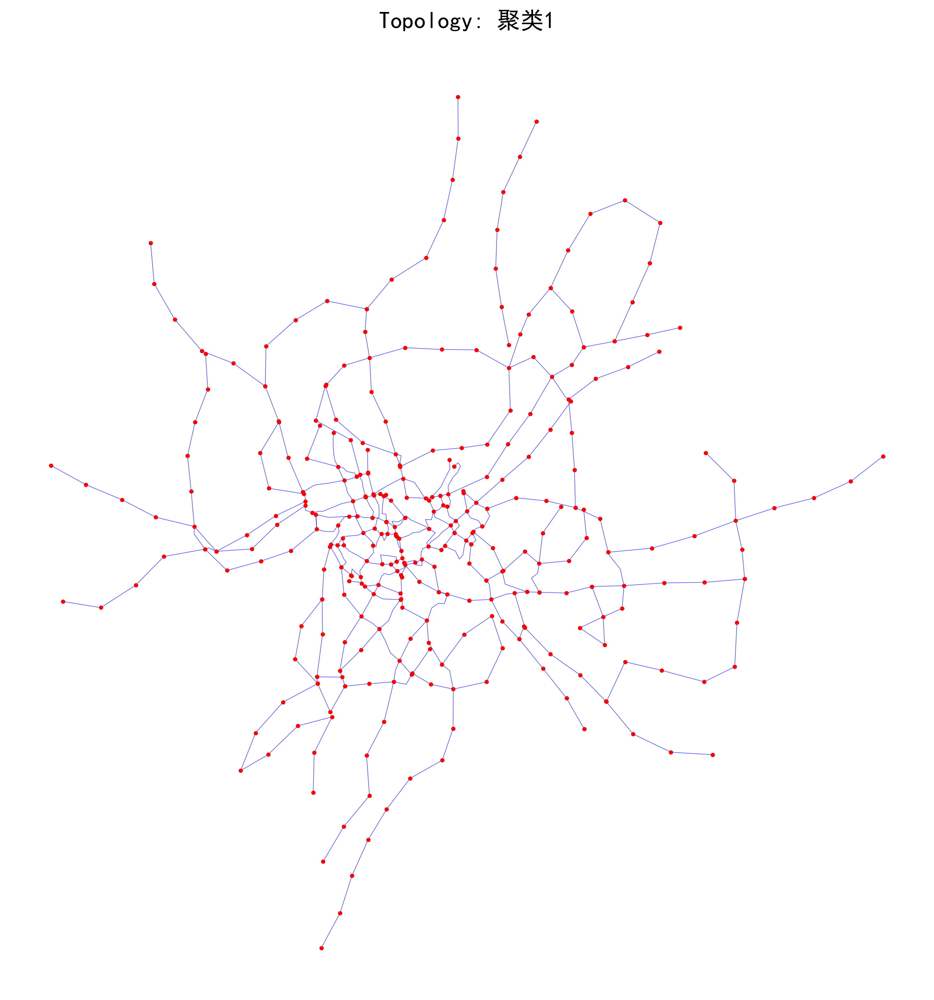
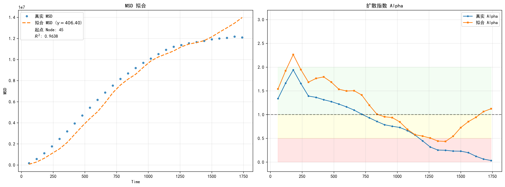

# 量子游走交通模拟 (Quantum Walk Traffic Simulation)

[](https://www.python.org/)
[](LICENSE)

本项目是一个用于**量子游走算法在城市交通流模拟中应用**的自动化数据处理与分析工作流。通过模块化的设计，将复杂的量子态演化、拓扑网络映射及结果分析拆分为独立可追溯的任务步骤。

## 📂 目录结构说明

```text
├── data/               # 原始数据（如路网拓扑、初始流量分布等）
├── results/            # 存放处理后的结果、图表（如概率分布图、收敛曲线）
├── src/                # 核心处理脚本
├── README.md           # 项目使用说明文档
└── requirements.txt    # 依赖库列表
```

---

## 🛠 功能特性

* ​**模块化设计**​：每一步处理逻辑独立，支持从中间步骤开始运行。
* ​**自动化流转**​：自动读取 data/ 输入，阶梯式生成中间变量并存储于 results/。
* ​**科研级绘图**​：内置基于 Matplotlib/Seaborn 的可视化脚本，直接生成符合论文标准的图表。

---

## 🚀 数据处理流程

请按顺序运行 src/ 中的脚本以完成全流程分析：

### Step 1: src/轨迹预处理与简化.py

* ​**功能**​：​**多源轨迹数据标准化与压缩清洗**​。
  
  * ​**智能解析**​：自动识别罗马数据（TXT/POINT 格式）及国内主流 CSV 轨迹格式，统一字段为 [id, time, lon, lat]。
  * ​**清洗去噪**​：利用 transbigdata 工具包剔除经纬度漂移点、异常速度点及冗余重复记录。
  * ​**轨迹简化**​：集成 ​**Douglas-Peucker (DP) 算法**​，在保留轨迹几何特征的前提下大幅降低数据维度。
  * ​**规范化输出**​：自动过滤长度不足 5 个点的无效轨迹，并对 ID 进行连续重编号，为后续量子游走模拟准备高质量输入。
* ​**输入**​：data/原始数据/ 目录下的原始 TXT 或 CSV 文件。
* ​**输出**​：data/原始数据处理后/ 目录下的规范化 \*\_cleaned.csv 文件。

### Step 2: src/总体数据统计.py

* ​**功能**​：​**高级去噪、轨迹分割与时空特征提取**​。
  
  * ​**自动范围锁定 (Auto-BBox)​**​：基于分位数算法自动识别并锁定城市地理范围，精准剔除跨城市或坐标异常（如 0,0）的噪点。
  * ​**动力学去噪**​：设定物理速度上限（150km/h），通过向量化位移计算过滤瞬移、跳点等非逻辑轨迹。
  * ​**逻辑分割与平滑**​：针对长时间停留数据进行轨迹切分，并应用滑动窗口算法（Rolling Mean）平滑定位误差，消除信号抖动。
  * ​**时长与点数过滤**​：自动剔除异常长（超过 3 小时）或记录点过稀疏的轨迹，确保建模数据的连贯性。
* ​**输入**​：data/原始数据处理后/ 目录下的清洗后 CSV。
* ​**输出**​：data/总体数据统计/ 目录下的高质量科研级轨迹数据。

### Step 3: src/总体统计绘制.py

* ​**功能**​：​**多维时空统计分析与扩散相变可视化**​。
  
  * **​基础分布统计 (四合一)**：自动提取并绘制轨迹的总位移、总时长、单次飞行长度（Flight Length）及瞬时速度的概率分布图，通过分位数算法剔除离群值，直观展现城市交通流的基础特征。
  * ​**MSD 均方位移分析**​：计算不同时间步（Δt）下的均方位移（Mean Squared Displacement），揭示个体的空间扩散速率。
  * **扩散相变指数提取**：利用 Savitzky-Golay 滤波器平滑对数曲线并计算梯度，动态识别轨迹处于“亚扩散”、“正常扩散”还是“超扩散”状态。
  * ​**严格截断机制**​：内置“触底反弹”与“零点截断”逻辑，自动识别并舍弃物理意义失效的数据区间，确保扩散特征分析的科研严谨性。
* ​**输入**​：data/总体数据统计/ 目录下的清洗后 CSV 文件。
* ​**输出**​：在 data/总体数据统计/ 下为每个文件生成同名专属文件夹，包含：
  
  * \*\_基础分布统计.png：宏观统计四合一图表。
  * \*\_扩散相变分析.png：MSD 与α指数演化图。
  * \*\_msd\_result\_full.csv & \*\_vis.csv：完整的扩散分析原始数据与截断后数据。

#### 📊 结果展示 (以罗马数据为例)

| 基础分布统计图                                      | 扩散相变分析图                                       |
| ----------------------------------------------------------------- | ----------------------------------------------------------------- |
|  | |

### Step 4: src/Rg计算与分类.py

* ​**功能**​：**个体移动性度量与多尺度分类（回转半径 Rg 分析）**。
  
  * ​**回转半径计算**​：利用大圆航线算法（Geodesic distance）计算每条轨迹相对于其质心的回转半径Rg​，作为衡量个体空间活动范围的核心指标。
  * ​**自适应聚类分析**​：集成 **K-means 聚类**与​**肘部法则（Elbow Method）**​，自动确定最佳分类数，将海量轨迹按空间扩张能力划分为不同能级（如：小尺度、中尺度、大尺度）。
  * ​**逻辑重排序**​：通过对聚类标签进行均值映射，确保分类结果具备物理意义（例如：Label 1 始终对应Rg​最小的短距离活动群体）。
  * ​**多层级数据拆分**​：自动生成分类后的子数据集，为后续研究不同移动性群体的量子游走特性提供样本支持。

#### 📊 结果展示 (以罗马数据为例)

| 肘部法则分析 (确定 K 值)                                        | 回转半径分布 (分类结果)                                         |
| ----------------------------------------------------------------- | ----------------------------------------------------------------- |
| |  |

* ​**输入**​：data/原始数据处理后/ 目录下的清洗后轨迹 CSV。
* ​**输出**​：在 data/分类后数据/ 目录下生成：
  
  * 聚类[1,2,3]轨迹数据.csv：按移动尺度拆分后的独立数据集。
  * 回转半径汇总.csv & 聚类标签结果.csv：详细的统计与分类标签对应表。

### Step 5: src/轨迹处理.py

* ​**功能**​：​**多尺度子集的二次物理精校与动态切分**​。
  
  * ​**分类细化清洗**​：针对 Step 4 分类后的“小/中/大”尺度数据集，进行针对性的物理逻辑校验。
  * ​**动态时间切分**​：设定 30 分钟为阈值，自动识别并切分轨迹中的长时间停驻点，将单一长轨迹拆分为具有连续运动特征的“子轨迹段”，以满足量子游走平稳过程的假设。
  * ​**动力学平滑**​：应用滑动窗口平滑算法（Smoothing）修正 GPS 定位抖动，提升轨迹的几何质量。
  * ​**递归结构保持**​：自动遍历 data/分类后数据/ 下的所有城市子文件夹，并保持原有的分类目录结构，实现全自动批量化处理。
* ​**关键参数**​：
  
  * MAX\_SPEED\_KMH = 150：剔除超物理常识的瞬移点。
  * MAX\_TIME\_GAP\_MIN = 30：超过 30 分钟无位移则切分为新轨迹。
  * MIN\_POINTS = 5：确保每一段分析样本具有足够的统计意义。
* ​**输入**​：data/分类后数据/ 目录下的各类尺度轨迹 CSV。
* ​**输出**​：在 data/清洗分割后数据/ 目录下生成同名的精修数据集，文件名自动变更为 \*\_轨迹处理数据.csv。

### Step 6: src/MSD局部扩散指数.py

* ​**功能**​：**群体性扩散特征建模与局部α指数解析**。
  
  * ​**群体 MSD 演化**​：在分类后的子集（小/中/大尺度）中，计算群体平均的均方位移（Ensemble MSD），揭示不同群体随时间推移的空间扩张规律。
  * ​**局部扩散指数提取**​：利用 Savitzky-Golay 滤波器对对数 MSD 曲线进行平滑处理，并提取时间维度的导数α(t)，动态识别交通流在不同时间阶段的物理属性（如：从超扩散向亚扩散的转变）。
  * ​**幂律拟合（Power-law Fit）**：在双对数坐标系下执行线性回归，自动计算全局比例系数与 R2 拟合优度。
  * ​**统计截断保护**​：内置 REBOUND\_THRESHOLD 截断逻辑，当数据样本量由于时间跨度过大而变得稀疏、导致α指数发生非物理性反弹时，自动进行截断以确保结论的科学性。

#### 📊 扩散特征结果展示

```
                                     α(t)指数演化
```



* ​**输入**​：data/清洗分割后数据/ 目录下的精修轨迹数据。
* ​**输出**​：在 data/群体 msd 分析结果/ 目录下为每个聚类生成：
  
  * \*轨迹的 MSD 变化以及扩散指数 α 以及量子模拟结果.csv：包含时间间隔、MSD 均值、Alpha 值的结构化数据。
  * \*轨迹的 MSD 变化以及扩散指数 α 以及量子模拟结果.png：包含 MSD 拟合曲线与α演化轨迹的双子图。

### Step 7: src/密度分区计算.py

* ​**功能**​：​**多尺度交通热点识别与高密度空间网格化分析**​。
  
  * ​**精细化网格映射**​：利用 transbigdata 库将地理坐标映射为高精度地理网格（默认精度 40m），实现从连续坐标到离散空间单元的转化。
  * ​**空间密度测算**​：统计每个网格单元内的轨迹点位频数，并基于分位数（Quantile）动态设定密度阈值，自动剥离低频背景噪声，锁定城市交通高负荷区域。
  * ​**地理信息可视化**​：集成 GeoPandas 绘制空间分布热力图，通过分级色彩（Quantiles Scheme）展现不同尺度群体（小/中/大Rg​ ）在城市空间中的占用特性。
  * ​**分区结果导出**​：保存高密度区域的轨迹索引，为后期量子游走算法在不同密度分布下的参数标定提供空间权重参考。

#### 📊 空间分布结果展示 (以罗马数据为例)

| 聚类尺度 1 (短途) 空间分布                                               | 聚类尺度 2 (长途) 空间分布                                               |
| -------------------------------------------------------------------------- | -------------------------------------------------------------------------- |
|  |  |

* ​**输入**​：data/分类后数据/ 目录下的多尺度轨迹数据集。
* ​**输出**​：在 data/密度分析结果/ 目录下生成：
  
  * \*轨迹空间分布.csv：记录了每个网格的坐标、点数及所属密度等级。
  * \*轨迹空间分布图.png：基于地理底图的网格化交通密度分布图。

### Step 8: src/密度自动道路提取.py

* ​**功能**​：​**基于计算机视觉算法的非结构化路网自动拓扑提取**​。
  
  * ​**热力图预处理**​：对 Step 7 生成的网格密度进行对数标准化，并应用 **高斯滤波 (Gaussian Blur)** 进行平滑处理，消除采样随机性导致的视觉空洞。
  * ​**多级阈值分割**​：采用 **滞后阈值法 (Hysteresis Thresholding)** 分别设置高、低双分位数，精准捕捉交通流的主干骨架并保留细小的支路连接。
  * ​**骨架化与迭代剪枝**​：通过 **Skeletonization 算法** 将带状交通流压缩为单像素宽度的中心线，并执行多次迭代剪枝 (Pruning)，剔除拓扑结构中的冗余毛刺与孤立断头路。
  * ​**矢量化与简化**​：利用 shapely 将栅格骨架转换为地理坐标系下的 LineString 矢量，并应用道格拉斯-普克算法进行几何简化，生成拓扑紧凑的数字化路网。

#### 🗺️ 提取效果展示

| 密度网格 (输入)                             | 自动提取路网 (输出)                                                           |
| --------------------------------------------- | ------------------------------------------------------------------------------- |
| |  |

* ​**输入**​：data/密度分析结果/ 目录下的轨迹空间分布 CSV。
* ​**输出**​：在 data/密度分析结果/[城市]/道路网络/ 目录下生成：
  
  * \*路网.shp：包含完整拓扑信息的矢量路网文件（可直接导入 ArcGIS/QGIS）。
  * \*路网预览图.png：用于快速验证提取质量的矢量化预览图。

### Step 9: src/构建road\_graph.py

* ​**功能**​：​**路网矢量拓扑重建与图结构（Graph）生成**​。
  
  * ​**坐标系自动投影**​：根据路网质心自动识别所属的 ​**UTM 投影带**​（如 EPSG:32649），将经纬度坐标转换为米制单位，确保长度计算（length_m）的物理精确性。
  * ​**拓扑融合与清理**​：利用 unary\_union 算子对 Step 8 提取的零散线段进行拓扑合并，修复断头路与重叠线段，并自动调用 make\_valid 纠正几何拓扑错误。
  * ​**动态边缘细分**​：根据研究区面积自动调整最大边长阈值（300m - 5000m），对超长路段进行等距插值分割，为后续量子游走提供更精细的演化网格。
  * ​**图论关系映射**​：自动提取所有交叉口为\*\*节点（Nodes）**并分配全局唯一 ID，同时建立**边（Edges）\*\*的拓扑关系表（包含 from\_node, to\_node, length），构建完整的数学图模型。

#### 🕸️ 拓扑构建结果展示

| 节点与边结构 (Graph)                                                     | 局部拓扑细节预览                   |
| -------------------------------------------------------------------------- | ------------------------------------ |
|  | (注：红点为网络节点，蓝线为拓扑边) |

* ​**输入**​：data/密度分析结果/[城市]/道路网络/ 目录下的路网 SHP 文件。
* ​**输出**​：在 data/路网结构拓扑构建/[城市]/ 目录下生成：
  
  * \*路网.shp：包含边属性（节点索引、长度）的矢量文件。
  * \*路网节点.shp：包含节点 ID 与空间坐标的矢量点文件。
  * \*路网预览图.png：节点与边连接关系的拓扑预览。

### Step 10: src/智能游走量子拟合.py

* ​**功能**​：​**基于连续时间量子游走 (CTQW) 的交通流演化模拟与物理参数回归**​。
  
  * ​**谱分解加速算法 (Spectral Acceleration)​**​：通过对路网拉普拉斯/邻接矩阵进行特征值分解，将量子态演化的计算复杂度从O(N3)降低至 O(N2)
    。利用特征空间投影避免了高频的矩阵指数运算，大幅提升了大规模路网（ N>1000）的模拟效率。
  * ​**智能起点搜索 (Smart Scout)​**​：结合交通枢纽性（Degree Centrality）、几何中心性（Geometric Center）以及网格采样技术，自动寻找最能代表城市交通发源地的量子游走初始节点。
  * ​**多阶段前向回归 (Multi-stage Fitting)​**​：
    
    * ​**粗扫阶段**​：在宽幅范围内寻找耦合常数γ的初步区间。
    * ​**精拟合阶段**​：通过双层梯度迭代，精确锁定使模拟 MSD 与真实 MSD 损失函数最小化的物理参数。
  * ​**物理一致性验证**​：同时拟合均方位移 (MSD) 与扩散指数α(t)
    ，确保模拟过程不仅在空间扩张速度上对齐，且在扩散相变行为上与真实交通流保持物理一致。

#### ⚛️ 量子模拟与真实数据对比展示α(t)

对齐验证

|| (注：虚线为量子模拟结果，圆点为观测数据) |
| - | - |

* ​**输入**​：
* data/群体 msd 分析结果/：真实交通流的动力学统计特征。
* data/路网结构拓扑构建/：Step 9 生成的标准路网图结构。
* ​**输出**​：在 data/量子游走前向回归结果/ 目录下生成：
  
  * \*量子 MSD 变化以及扩散指数 α 图.csv：量子模拟与真实轨迹的对比数据表。
  * \*量子 MSD 变化以及扩散指数 α 图.png：包含γ 拟合值、R2评分及相变区间覆盖的可视化报告。

### 注：Step 11（第1步之后可直接运行下面代码进行一步化处理）

```
python src/运行主程序.py
```

## 📖 使用指南

### 1. 环境准备

建议使用 Python 3.9+ 环境。首先克隆仓库并安装依赖：

### 2. 运行模拟

进入项目根目录，按顺序执行代码：

---

## 📝 注意事项

* ​**路径依赖**​：请确保在项目根目录下运行脚本，脚本内部使用相对路径。
* ​**内存占用**​：量子矩阵演化可能消耗较多内存，建议在 16GB RAM 以上环境运行。

## 🤝 帮助与支持

* ​**项目维护**​：[你的名字]
* ​**联系邮箱**​：[你的邮箱地址]


## 数据下载与使用说明 (Data Description)

由于本项目涉及的原始轨迹数据及生成的中间结果文件较大（单个文件超过 100MB），无法直接上传至 GitHub 仓库。为了保证代码能够正常运行，请按照以下步骤获取数据：

1. **下载数据**：
   - 链接: [百度网盘下载地址](https://pan.baidu.com/s/1OBOrfi-s4tZMMxY10EX2NA?pwd=4hmd)
   - 提取码: `4hmd`


